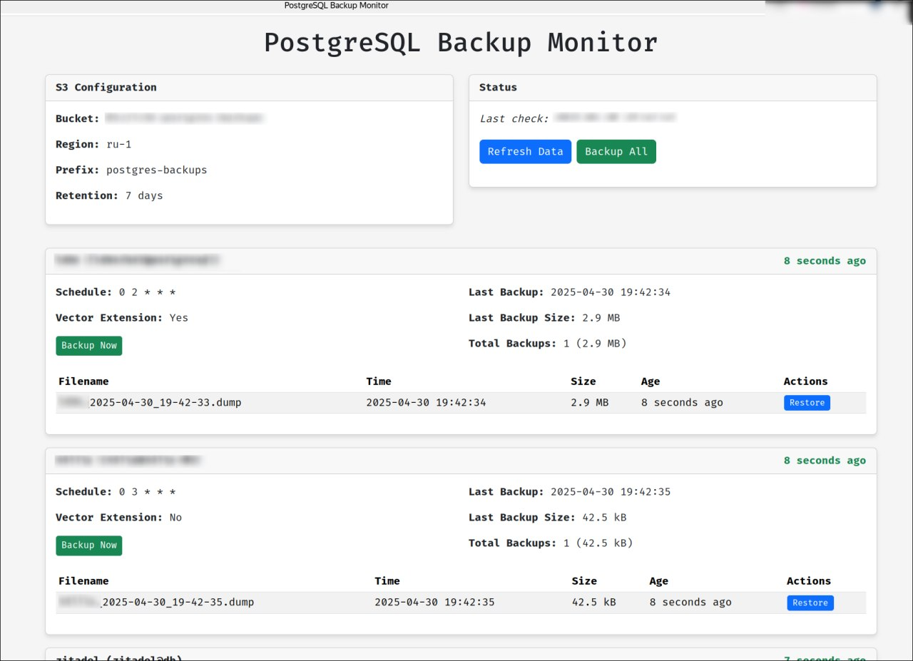

# PostgreSQL Backup to S3

A simple Python service for backing up PostgreSQL databases (including those with vector extensions) to S3.



## Features

- Automatic scheduled backups of multiple PostgreSQL databases
- Support for PostgreSQL with vector extensions (pgvector)
- Configurable backup retention policy
- S3 storage for backups
- Restore functionality from any backup
- Docker-based deployment

## Configuration

Edit the `config.yaml` file to configure your databases and S3 settings:

```yaml
s3:
  bucket: your-bucket-name
  region: your-region
  access_key: your-access-key
  secret_key: your-secret-key
  prefix: backups  # Optional prefix for backup files in S3

retention:
  days: 7  # Number of days to keep backups

databases:
  - name: db1
    host: postgres-service1
    port: 5432
    user: postgres
    password: password
    database: db1
    schedule: "0 2 * * *"  # Cron schedule (daily at 2 AM)
    vector_extension: true  # Set to true if the database uses pgvector extension
  
  - name: db2
    host: postgres-service2
    port: 5432
    user: postgres
    password: password
    database: db2
    schedule: "0 4 * * 0"  # Weekly on Sunday at 4 AM
    vector_extension: false
```

## Usage

### Setup

```bash
cp config_example.yaml config.yaml
```

Edit the `config.yaml` file to configure your databases and S3 settings.

```bash
cp .env.example .env
```

Edit the `.env` file to configure your environment variables.

_Notes:_
- I'm using traefik as reverse proxy, and compose file is configured for it.
- If you don't use reverse proxy, don't forget to expose the port to the outside.
- DB user should have enough permissions to restore databases, **check it before** real usage. (Creating backup NOT equals to restoring it)

### Build and Run with Docker

Personally, I prefer to use docker compose to build and run the container.

Build the Docker image
```bash
docker compose build
```

_Note:_ It's mount only the `config.yaml` file, not the rest of project.

Run the container
```bash
docker compose up -d
```

Open the web UI in your browser: `http://<your-service-domain>`

### Restore from Backup

Now it works from GUI, but you can use CLI too.

To list available backups:
```bash
docker exec -it postgres-backup-s3 python /app/restore.py db1 --list
```

To restore the latest backup:
```bash
docker exec -it postgres-backup-s3 python /app/restore.py db1
```

To restore a specific backup by number:
```bash
docker exec -it postgres-backup-s3 python /app/restore.py db1 --backup-number 3
```


**Note:** After restore, you need to restart the service to apply changes.

### About schedule notation

The schedule is in cron format.

Namely, schedule format consists of 5 fields:

```
* * * * *
│ │ │ │ │
│ │ │ │ └── Day of the week (0-6, where 0 is Sunday)
│ │ │ └──── Month (1-12)
│ │ └────── Day of the month (1-31)
│ └──────── Hour (0-23)
└────────── Minute (0-59)
```

## Common Schedule Patterns

| Schedule | Description | Cron Expression |
|----------|-------------|----------------|
| Every 5 minutes | Runs every 5 minutes | `*/5 * * * *` |
| Hourly | Runs at the start of every hour | `0 * * * *` |
| Daily at midnight | Runs once a day at midnight | `0 0 * * *` |
| Daily at 2 AM | Runs once a day at 2:00 AM | `0 2 * * *` |
| Weekly on Sunday at 3 AM | Runs once a week on Sunday at 3:00 AM | `0 3 * * 0` |
| Monthly on the 1st at 4 AM | Runs once a month on the 1st at 4:00 AM | `0 4 1 * *` |
| Quarterly | Runs on the 1st day of Jan, Apr, Jul, Oct at 5 AM | `0 5 1 1,4,7,10 *` |
| Yearly on January 1st at 6 AM | Runs once a year on January 1st at 6:00 AM | `0 6 1 1 *` |

## Special Expressions

| Expression | Description |
|------------|-------------|
| `@yearly` or `@annually` | Run once a year at midnight on January 1st (`0 0 1 1 *`) |
| `@monthly` | Run once a month at midnight on the 1st (`0 0 1 * *`) |
| `@weekly` | Run once a week at midnight on Sunday (`0 0 * * 0`) |
| `@daily` or `@midnight` | Run once a day at midnight (`0 0 * * *`) |
| `@hourly` | Run once an hour at the beginning of the hour (`0 * * * *`) |


## Known issues

- Sometimes restore by button may not work (and CLI too), in my case it was with Zitadel SSO service.
- - Solution: Just stop service, remove database, create & init it again, start service and restore from backup.
- - It's a bit tricky, but it works.